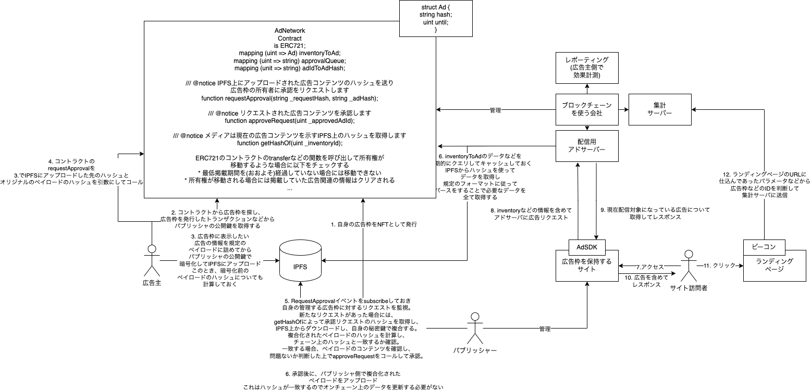

# Blockchain AdNetwork

Blockchain AdNetwork is a simple implementation of a reserved advertising ad network that works on
the basis of smart contracts on Ethereum.

Below is a schematic diagram that outlines the initial concept. The parts related to the details
have been changed.



# Components

Blockchain Ad Network mainly consists of three components.

* Ad Network Contract on Ethereum
* DApps that can manage Advertisement and Advertising Inventory
* Third-party Applications that functions as Ad Delivery Server

Additionally, if you needed, CDN to deliver Ad Images and Measurement Services such as Google Tag
Manager are available.

This repository provides three components above, and Ad Image Serving instead of CDN.

# Build contracts

```sh
# build solidity contracts
cd adnetwork-contracts/
truffle build
# generate type definition file for DApps
cd client/
npm run typechain
```

# How to use on Ganache

## Deploy our contract to Ganache

Firstly, you need to stand up your own local network using Ganache.

After that, build our Solidity contracts by using `truffle build` command at `./adnetwork-contracts`
directory.

If any problem isn't found, deploy our contracts to Ganache Network by using `truffle migrate`
command.

## Start backend Application

...

## Start DApps

...

## Ad Delivery

* override clock using delivery

```shell
curl -v -X POST "http://localhost:8080/admin/clock?millis=1646112949000"
```

* reload inventory cache forcibly

```shell
curl -v -X POST "http://localhost:8080/admin/reload"
```

* delivery request from command line

```shell
curl -X POST -H 'Content-Type: application/json' -d '{"inventoryId":1}' http://localhost:8080/delivery
{"adId":1,"adFormatV1Dto":{"inventoryId":1,"ownerAddress":"0x9F3868ce2fc5e535da82fa1cC3A779EACf75285E","startTime":1646036100,"endTime":1646727300,"adPrice":1500,"adTitle":"Test Ad","adDescription":"This is test ads","landingPageUrl":"http://localhost:3000/ads/create","displayImageUrl":"http://localhost:8080/public/images/0x9F3868ce2fc5e535da82fa1cC3A779EACf75285E-99ef04a6-b7a0-4b82-98ef-0ba249c55ce4.jpeg","nonce":"Ysr0rDNlZBpO/poiWz4WyQ=="},"found":true}
```

* delivery test on your browser

```shell
open testpage/delivery_test.html
```

# Appendix.

## How do we guarantee that your advertising information will be kept confidential until it is delivered?

広告情報は、広告主が作成し、出稿先の広告枠の所有者と、実際に広告を配信するサードパーティのみが閲覧可能である必要があります。

また、パブリックチェーンでは誰もが情報を自由に読み取ることができますが、広告情報が配信前に事前にわかってしまうことは様々な不都合を起こす可能性があります。

そのため、公開情報として書き込まれるデータは暗号化されている必要があります。

以下の方法を用いて、情報を非公開にしたまま広告情報をやり取りして広告配信までのフローを実施できます。

1. 広告枠に事前にRSAの公開鍵を登録しておく。広告枠ごとに別のキーペアが登録可能です。
2. 広告主は出稿時にAdFormatV1のフォーマットに従った広告情報を記述し、これをAES-GCM共通鍵暗号化方式によって暗号化します。さらに共通鍵を広告枠の公開鍵で暗号化します。
3. 広告主は、AdFormatのバージョン情報を含む1
   byteのヘッダと、暗号化された共通鍵、共通鍵で暗号化されたAdFormatV1のデータを結合してIPFSなどのストレージに保存します。この時、最終的なペイロードのSHA-3ハッシュの値によって参照できるようにします。(
   このレポジトリではバックエンドアプリケーションがこのストレージの役割を持ちます)
4. 広告の配信者の公開鍵を用いて同様の操作を行います。この時点で、広告の配信者用と広告枠の所有者用の2つのデータが生成されます。
5. 広告枠の所有者は、承認待ちの広告を確認し、SHA-3ハッシュによって暗号化されたペイロードを取得します。
   広告枠の秘密鍵を使って共通鍵を復号し、さらにAdFormatV1データを複合します。この中身を確認し、広告枠の所有者は広告の審査を行います。
7. 審査に問題がなければ、コントラクトに承認トランザクションを送信します。
8. 広告が承認された時点で、広告配信サーバーで広告情報の取得が始まり、広告配信者用の秘密鍵を用いて広告情報が復号されて配信に利用可能になります。

